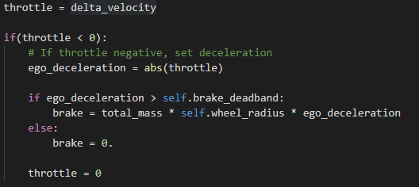
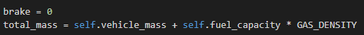

### Output


The car was able to detect the traffic lights in the simulation and reacted on them as per the expectations.

Please refer to the video [Video](./imgs/output.mp4)

### Setup

I have used the latest version of keras and tensorflow. The keras and tensorflow version mentioned in the requirements.txt have some bugs for e.g. ( keras load_model gives an error which is fixed in later version, tensorflow softmax does not accept axis as inputs which is also fixed in later versions).

I used the virtual machine provided by Udacity. I had lot of difficulties in the initial machine setup as due to proxy setup on my network, I could not use "pip" package manager and relied on "conda". Conda has some issues with regard to python-socketio and ros_pkg libs.

Nevertheless, after lot of configuration issues, I managed to run the native setup.

I started the project by implementing the Traffic Light Classifier. It was not so difficult as it needed a simple CNN. Challenge was to extract data. To do so, I extracted traffic light images from the simulation and also from ros bag file provided by Udacity. I wrote a script to extract the images from the bag files.

The instructions were already given in detail in the project descriptions thus not providing those details.

# Software Architecture


## Node Architecture of the project

The nodes structure in the project are as below:


## 1. Perception System
 
### Traffic Light Classifier

From the extracted images, I created a dataset manually which looks like this:


[Dataset Dir Link](./ros/src/tl_detector/tl_classifier_trainer/dataset/)

I then wrote a traffic light classifier

I designed a simple network as follows:


The input size of the images were choosen to be (224, 224). I tried using lower resolution but I didnt find the results satisfactory.

Since, the images I had were limited, I used some basic image augmentations [Line 37](./ros/src/tl_detector/tl_classifier_trainer/train.py#L37) to create augmented images. This way I had around 1101 samples, 990 for training and 111 for validation. This helped me in increasing the accuracy rate, trust me I spend hours in getting the right model :)

The model [Line 55](./ros/src/tl_detector/tl_classifier_trainer/train.py#L55) acheived around 99% accuracy.


### tl_detector node

The tl\_detector node used the stop
Example of the image extracted by tl_detector node and fed to the classifier

The tl\_detector node does the following:

1. It fetches the location of the traffic lights from the stop_line_positions provided in the config.
2. It publishes the traffic light waypoint.
3. It loads the traffic light classifier explained above.
4. Once the image is captured and received [Line 103](./ros/src/tl_detector/tl_detector.py#L103), the image is passed on to the trained classifier.
5. The nearest traffic light is identified and processed [Line 217](./ros/src/tl_detector/tl_detector.py#L217)
6. The classifier return the state/class of the traffic light and publishes.


# Control SubSystem

## Drive By Wire (DBW) Node


The DBW node controls the following:

1. Throttle
2. Steering
3. Brakes

Each of the following has an independent controller and does the following:

1. **Throttle Controller**: It is a PID controller similar to MPC project done in previous term. The Throttle is set as per the difference in the veloctiy computed from the error in the desired and current velocity.



2. **Steering Controller**: Its again a PID controller which uses the cross track error [Line 73](./ros/src/twist_controller/twist_controller.py#L73), along with a predictive pid controller [Line 74](./ros/src/twist_controller/twist_controller.py#L74).
The final steering value is the difference of the two.


3. **Brake Controller**: It considers the overall mass of the vehicle, the wheel radius and the set deceleration to compute the final braking value.
[Line 67](./ros/src/twist_controller/twist_controller.py#L67).




# Planning SubSystem

This subsystem is responsible to do path planning using the current ego car velocity and position. These two parameters along with preset waypoints are passed on the our control system.

## Waypoint Updater

The main path planning setup is within this node. It is responsible for deciding the velocity at each position during the entire run. It mainly uses current ego position, velocity and list of the waypoints.


As each waypoint has a velocity and position associated with it, it helps in planning a path. The moment ego car change its position, a new path is generated. It sets the acceleration and deceleration factors as well.


It also uses the traffic light position, in case a traffic light is in sight, a must stop waypoint index is selected and the ego car should start decelerating until this waypoint. Beyond this waypoint, the velocity is set to 0. Once, the traffic light is green, the velocities for waypoints is reset and the ego car continues.


## Observations

* The PID controller does not seem to be very smooth at times, especially when ego car stops and wait at the traffic light.
* The traffic light detection reacts slowly when ego car drives on maximum speed. The zoom in feature should be considered to avoid this.

-------------------------------------------------------------------------------------------------------------------------------------

This is the project repo for the final project of the Udacity Self-Driving Car Nanodegree: Programming a Real Self-Driving Car. For more information about the project, see the project introduction [here](https://classroom.udacity.com/nanodegrees/nd013/parts/6047fe34-d93c-4f50-8336-b70ef10cb4b2/modules/e1a23b06-329a-4684-a717-ad476f0d8dff/lessons/462c933d-9f24-42d3-8bdc-a08a5fc866e4/concepts/5ab4b122-83e6-436d-850f-9f4d26627fd9).

Please use **one** of the two installation options, either native **or** docker installation.

### Native Installation

* Be sure that your workstation is running Ubuntu 16.04 Xenial Xerus or Ubuntu 14.04 Trusty Tahir. [Ubuntu downloads can be found here](https://www.ubuntu.com/download/desktop).
* If using a Virtual Machine to install Ubuntu, use the following configuration as minimum:
  * 2 CPU
  * 2 GB system memory
  * 25 GB of free hard drive space

  The Udacity provided virtual machine has ROS and Dataspeed DBW already installed, so you can skip the next two steps if you are using this.

* Follow these instructions to install ROS
  * [ROS Kinetic](http://wiki.ros.org/kinetic/Installation/Ubuntu) if you have Ubuntu 16.04.
  * [ROS Indigo](http://wiki.ros.org/indigo/Installation/Ubuntu) if you have Ubuntu 14.04.
* [Dataspeed DBW](https://bitbucket.org/DataspeedInc/dbw_mkz_ros)
  * Use this option to install the SDK on a workstation that already has ROS installed: [One Line SDK Install (binary)](https://bitbucket.org/DataspeedInc/dbw_mkz_ros/src/81e63fcc335d7b64139d7482017d6a97b405e250/ROS_SETUP.md?fileviewer=file-view-default)
* Download the [Udacity Simulator](https://github.com/udacity/CarND-Capstone/releases).

### Docker Installation
[Install Docker](https://docs.docker.com/engine/installation/)

Build the docker container
```bash
docker build . -t capstone
```

Run the docker file
```bash
docker run -p 4567:4567 -v $PWD:/capstone -v /tmp/log:/root/.ros/ --rm -it capstone
```

### Port Forwarding
To set up port forwarding, please refer to the [instructions from term 2](https://classroom.udacity.com/nanodegrees/nd013/parts/40f38239-66b6-46ec-ae68-03afd8a601c8/modules/0949fca6-b379-42af-a919-ee50aa304e6a/lessons/f758c44c-5e40-4e01-93b5-1a82aa4e044f/concepts/16cf4a78-4fc7-49e1-8621-3450ca938b77)

### Usage

1. Clone the project repository
```bash
git clone https://github.com/udacity/CarND-Capstone.git
```

2. Install python dependencies
```bash
cd CarND-Capstone
pip install -r requirements.txt
```
3. Make and run styx
```bash
cd ros
catkin_make
source devel/setup.sh
roslaunch launch/styx.launch
```
4. Run the simulator

### Real world testing
1. Download [training bag](https://s3-us-west-1.amazonaws.com/udacity-selfdrivingcar/traffic_light_bag_file.zip) that was recorded on the Udacity self-driving car.
2. Unzip the file
```bash
unzip traffic_light_bag_file.zip
```
3. Play the bag file
```bash
rosbag play -l traffic_light_bag_file/traffic_light_training.bag
```
4. Launch your project in site mode
```bash
cd CarND-Capstone/ros
roslaunch launch/site.launch
```
5. Confirm that traffic light detection works on real life images
